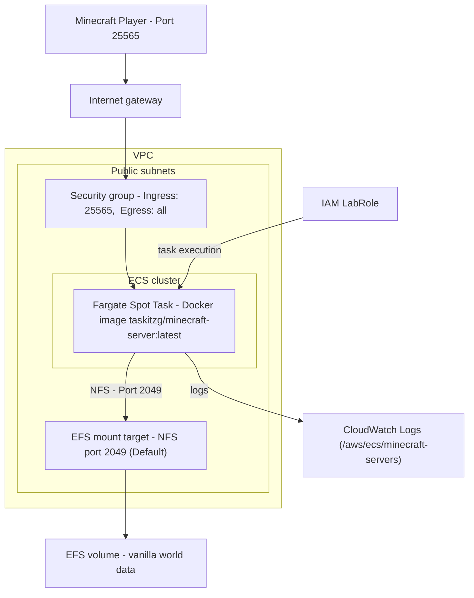
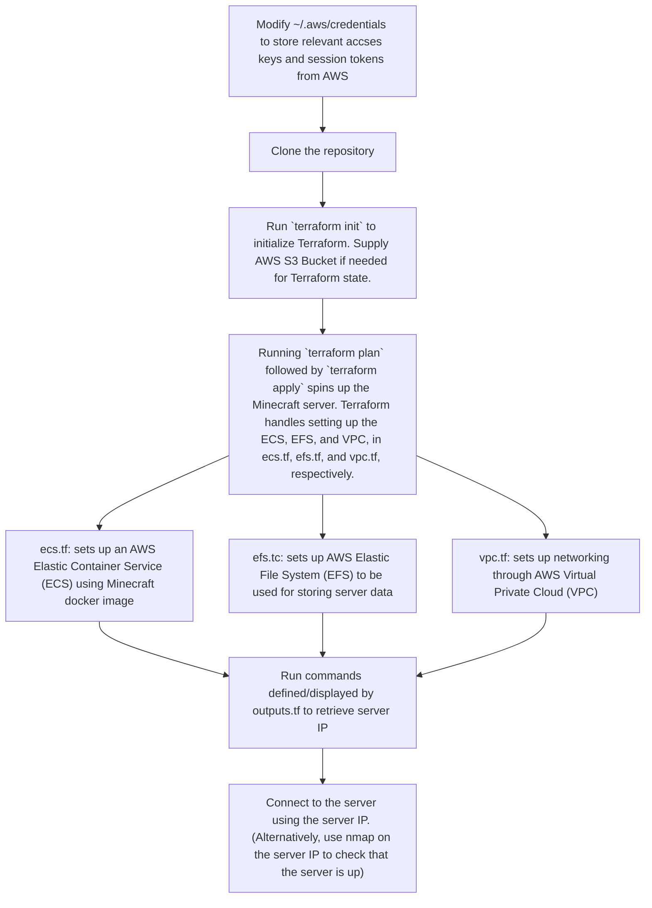

# Background
This project fully automates the provisioning, configuring, and setup of a Minecraft server using a Docker image [\[4\]](#references) and Terraform on AWS ECS. Server data is stored on an EFS instance. This project follows the tutorial given by [\[1\]](#references), with cost-lowering revisions by [\[2\]](#references). Some modifications were made to use the provided IAM role, `LabRole`, as this project was done on AWS Learner Lab.

# Requirements
For this, you will need to have:
- An AWS account
- [Terraform](https://developer.hashicorp.com/terraform/install) installed
- [AWS CLI](https://docs.aws.amazon.com/cli/latest/userguide/cli-chap-getting-started.html) installed, AWS account logged in
- [Git](https://git-scm.com/), for cloning this repository

# Architecture Diagram


# Pipeline Diagram

<!-- ## Written Pipeline Steps
The steps of the pipeline are as follows:
1. Modify the file `~/.aws/credentials` to store the relevant access keys and session tokens from AWS
2. Clone the repository
3. Run `terraform init` to initialize Terraform
4. Running `terraform plan` followed by `terraform apply` spins up the Minecraft server. Terraform handles setting up the ECS (Elastic Container Service), EFS (Elastic File System), and VPC (Virtual Private Cloud), in `ecs.tf`, `efs.tf`, and `vpc.tf`, respectively. 
      - `ecs.tf` sets up an AWS ECS container service using this [Minecraft Docker Image](https://github.com/itzg/docker-minecraft-server)
      - `efs.tf` sets up an AWS EFS, which the ECS instance uses to store Minecraft server data
      - `vpc.tf` sets up the AWS VPC used to faciliate networking/connections to the server
      - `locals.tf` contains configurable data, such as the CIDR to use for the VPC. 
      -  `variables.tf` contains the Minecraft username(s) to be whitelisted (allowed into the server).
5. Run the commands in Step 7 of "[Running the Minecraft Server](#running-the-minecraft-server)" to retrieve the server IP
6. Connect to the Minecraft server using the IP. 
   - Alternatively, access it with `nmap -sV -Pn -p T:<query_port> <instance_public_ip>`. This will require downloading [`nmap`](https://nmap.org/download.html) -->

# Running the Minecraft Server
1. Modify the file `~/.aws/credentials` to store the following information from AWS: 
   ```
   [default (or a name of your choice)]
   aws_access_key_id=your_aws_access_key
   aws_secret_access_key=your_aws_secret_access_key
   aws_session_token=your_aws_session_token
   ```
2. Run `git clone https://github.com/jamie-dang-n/CS_312_Course_Proj_pt2.git` to clone this repository.
3. `cd` into `CS_312_Course_Proj_pt2`. 
4. Edit `locals.tf` as needed to set variables such as AWS region, VPC CIDR, etc.
5. Run `terraform init` to initialize Terraform
6. Run `terraform plan` to error-check the cloned `.tf` files
   - There should be no error messages, but if there are, refer to the Terraform and AWS documentation for support [\[3\]](#references).
7. Run `terraform apply` to spin up the Minecraft server
   - If prompted, supply your Minecraft username to whitelist your connection to the server
8. Wait for about 5 minutes for the Minecraft server to start
9. Run the following commands to get the server's IP address:
    ```bash
    TASK_ARN=$(aws ecs list-tasks --cluster minecraft-servers --query 'taskArns[0]' --output text)

    ENI_ID=$(aws ecs describe-tasks --cluster minecraft-servers --tasks $TASK_ARN \
    --query 'tasks[0].attachments[0].details[?name==`networkInterfaceId`].value' --output text)

    aws ec2 describe-network-interfaces --network-interface-ids $ENI_ID \
    --query 'NetworkInterfaces[0].Association.PublicIp' --output text
    ```
    - If the output of the above command is "None", wait for a bit before trying again. It is possible that the Minecraft task has not started running yet.
    - Note: The server IP will change, because the IP is not static-- the configuration does not use Elastic IP for cost saving.
    - Optionally, verify that the server is accessible with `nmap -sV -Pn -p T:<query_port> <instance_public_ip>`. This will require downloading [`nmap`](https://nmap.org/download.html).

# Running via GitHub Actions
Alternatively, the server can be started through GitHub Actions. The pipeline .yml files are stored in `.github/workflows`. 

The CI/CD workflows are for setting up and tearing down Minecraft server infrastructure with Terraform. I modified the `.yml` files from  [\[5\]](#references) to create the CI/CD workflows. 

## Prerequisites

### S3 Bucket
An S3 bucket is necessary to share Terraform state across different runner instances.

The `terraform.yml` file already creates an S3 bucket if it does not exist, using the secret variable [`TF_STATE_BUCKET_NAME`](#secrets-variables). Therefore, it is not necessary to manually create an S3 bucket before running the CI/CD workflow.

To create a bucket manually anyway:

```bash
aws s3api create-bucket \
    --bucket BUCKET_NAME \
    --region AWS_REGION
```

If the `terraform.yml` workflow sees that a bucket has already been created, it will continue without failing.

### "Secrets" Variables
Clone the repository, then define the following "Repository secrets" variables under Settings &rarr; Secrets and Variables &rarr; Actions:
- Information to access the AWS CLI (given by AWS)
  - `AWS_ACCESS_KEY_ID`
  - `AWS_REGION`
  - `AWS_SECRET_ACCESS_KEY`
  - `AWS_SESSION_TOKEN`
- `MINECRAFT_USERNAME`: used to whitelist a Minecraft user, giving them access to the server.
- `TF_STATE_BUCKET_NAME`: used to store Terraform state across runners

## Workflow Steps
1. Run `git clone https://github.com/jamie-dang-n/CS_312_Course_Proj_pt2.git` to clone this repository.
2. Set [secret variables](#secrets-variables) in the cloned repository on GitHub under Settings &rarr; Secrets and Variables &rarr; Actions.
3. `cd` into `CS_312_Course_Proj_pt2`.
4. Edit `locals.tf` as needed to set variables such as AWS region, VPC CIDR, etc.
5. When changes get pushed to `main`, the pipeline will run
6. To destroy all resources, go to Actions &rarr; Terraform Destroy and click the "Run workflow" button. 
   - It'll prompt you to type `destroy` to confirm that you want to run the Terraform Destroy pipeline.
   - Destroying resources is not done automatically, it must be triggered manually

If the provided server IP does not work, feel free to rerun the Terraform job to see if the server IP changed. `terraform apply` won't make additional changes, so it is safe to re-run the entire job to double check/update the server IP.

## Overview of Files

### `terraform.yml`

`terraform.yml` is used to create the Minecraft server. The workflow does the following:

1. Check out the repository
2. Set up Terraform
3. Configure AWS Credentials
4. Create the Terraform AWS S3 State Bucket (if it does not already exist)
5. Initialize Terraform with the S3 State Bucket
6. Run `terraform plan`
7. Create infrastructure using `terraform apply`
8. Wait for ECS task to start
9.  Get the Minecraft Server IP, then print it in the GitHub Actions GUI

This workflow only triggers on pushes to the `main` branch.

### `terraform-destroy.yml`

`terraform-destroy.yml` is used to destroy/clean up all Minecraft server resources. The workflow does the following:

1. Check out the repository
2. Set up Terraform
3. Configure AWS Credentials
4. Create the Terraform AWS S3 State Bucket (if it does not already exist)
5. Initialize Terraform with the S3 State Bucket
6. Destroy all resources with `terraform destroy`
7. Cleanup possibly-hanging extraneous resources (KMS Alias, CloudWatch Log Groups)

This workflow only triggers manually, after confirming on the GitHub Actions GUI that you want to run the workflow (by writing `delete`). 

# Connecting to the Minecraft Server
If following "[Running the Minecraft Server](#running-the-minecraft-server)", then run the commands in Step 7 and copy the IP address to directly connect to the server in Minecraft.

If following "[Running via GitHub Actions](#running-via-github-actions)", then navigate to Actions &rarr; `your current workflow` &rarr; "Print Server IP" to view the server's public IP. From there, copy the IP address to directly connect to the server in Minecraft. (Alternatively, view the "Terraform summary" at Actions &rarr; `your current workflow`.)


In both cases, you can verify that the server is accessible with `nmap -sV -Pn -p T:<query_port> <instance_public_ip>`. This will require downloading [`nmap`](https://nmap.org/download.html)

# References
\[1\] [https://www.thelastdev.com/p/learning-ecs-the-fun-way-hosting](https://www.thelastdev.com/p/learning-ecs-the-fun-way-hosting)

\[2\] [https://github.com/siakon89/minecraft-server/tree/budget-server](https://github.com/siakon89/minecraft-server/tree/budget-server)

\[3\] [https://registry.terraform.io/providers/hashicorp/aws/latest/docs](https://registry.terraform.io/providers/hashicorp/aws/latest/docs)

\[4\] [https://github.com/itzg/docker-minecraft-server](https://github.com/itzg/docker-minecraft-server)

\[5\] [https://dev.to/aws-builders/provisioning-aws-infrastructure-using-terraform-and-github-actions-40ei](https://dev.to/aws-builders/provisioning-aws-infrastructure-using-terraform-and-github-actions-40ei)