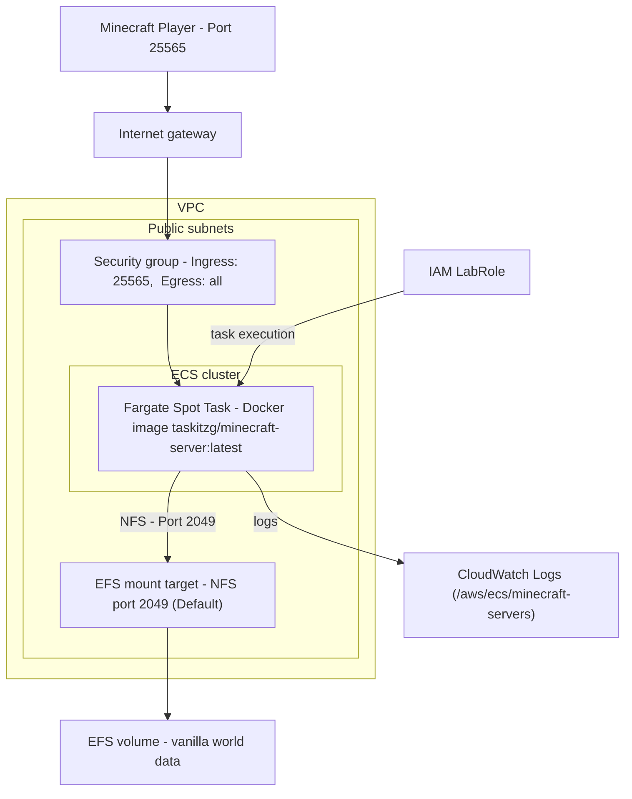

# Background
This project fully automates the provisioning, configuring, and setup of a Minecraft server using a Docker image and Terraform on AWS ECS. Server data is stored on an EFS instance. This project follows the tutorial given by [\[1\]]((https://www.thelastdev.com/p/learning-ecs-the-fun-way-hosting)), with cost-lowering revisions by [\[2\]]((https://github.com/siakon89/minecraft-server/tree/budget-server)). Some modifications were made to use the provided IAM role, `LabRole`, as this project was done on AWS Learner Lab.

# Requirements
For this, you will need to have:
- An AWS account
- [Terraform](https://developer.hashicorp.com/terraform/install) installed
- [AWS CLI](https://docs.aws.amazon.com/cli/latest/userguide/cli-chap-getting-started.html) installed, AWS account logged in
- [Git](https://git-scm.com/), for cloning this repository

# Pipeline Diagram


## Pipeline Stages
Terraform handles setting up the ECS, EFS, and VPC, in `ecs.tf`, `efs.tf`, and `vpc.tf`, respectively. The file `locals.tf` contains configurable data, such as the CIDR to use for the VPC. 

(WIP)

# Running the Minecraft Server
1. Run `git clone https://github.com/jamie-dang-n/CS_312_Course_Proj_pt2.git` to clone this repository.
2. `cd` into `CS_312_Course_Proj_pt2`. 
3. Run `terraform init` to initialize Terraform
4. Run `terraform plan` to error-check the cloned `.tf` files
   - There should be no error messages, but if there are, refer to the Terraform and AWS documentation for support [\[3\]](https://registry.terraform.io/providers/hashicorp/aws/latest/docs).
5. Run `terraform apply` to spin up the Minecraft server
   - If prompted, supply your Minecraft username to whitelist your connection to the server
6. Wait for about 5 minutes for the Minecraft server to start
7. Run the following commands to get the server's IP address:
    ```bash
    TASK_ARN=$(aws ecs list-tasks --cluster minecraft-servers --query 'taskArns[0]' --output text)

    ENI_ID=$(aws ecs describe-tasks --cluster minecraft-servers --tasks $TASK_ARN \
    --query 'tasks[0].attachments[0].details[?name==`networkInterfaceId`].value' --output text)

    aws ec2 describe-network-interfaces --network-interface-ids $ENI_ID \
    --query 'NetworkInterfaces[0].Association.PublicIp' --output text
    ```
    - Note: The server IP will change, because the IP is not static-- the configuration does not use Elastic IP for cost saving.
    - Optionally, verify that the server is accessible with `nmap -sV -Pn -p T:<query_port> <instance_public_ip>`. This will require downloading [`nmap`](https://nmap.org/download.html)

# Connecting to the Minecraft Server
Run the commands in Step 7 of "[Commands to run](#commands-to-run)". Then, copy the IP address to directly connect to the server in Minecraft.

# References
\[1\] [https://www.thelastdev.com/p/learning-ecs-the-fun-way-hosting](https://www.thelastdev.com/p/learning-ecs-the-fun-way-hosting)

\[2\] [https://github.com/siakon89/minecraft-server/tree/budget-server](https://github.com/siakon89/minecraft-server/tree/budget-server)

\[3\] [https://registry.terraform.io/providers/hashicorp/aws/latest/docs](https://registry.terraform.io/providers/hashicorp/aws/latest/docs)